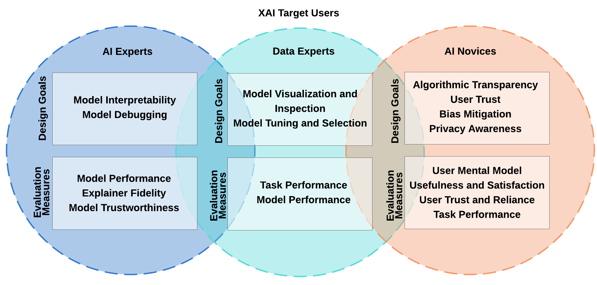

# Awesome-XAI-Evaluation [](https://github.com/sindresorhus/awesome)

An awesome and organized reference list of evaluation measures and methods for explainable machine learning (XAI) algorithms and systems. If you need more details and descriptions, you can read the [*full paper*](https://arxiv.org/pdf/1811.11839.pdf) or visit [my page](http://people.tamu.edu/~sina.mohseni/webpage/research.html) for more resources!


## How to Evaluate XAI?

We reviewed XAI-related research to organize different XAI design goals and evaluation measures. This awesome-list presents our categorization of selected existing design and evaluation methods that organizes literature along three perspectives: **design goals**, **evaluation methods**, and **targeted users** of the XAI system. We provide summarized ready-to-use tables of evaluation methods and recommendations for different goals in XAI research. 
<!-- ## What is this awesome list about? -->




  
### Citation

Description and details in this paper: https://arxiv.org/pdf/1811.11839.pdf

```
@article{mohseni2018multidisciplinary,
  title={A Multidisciplinary Survey and Framework for Design and Evaluation of Explainable AI Systems},
  author={Mohseni, Sina and Zarei, Niloofar and Ragan, Eric D},
  journal={arXiv preprint arXiv:1811.11839},
  year={2018}
}
```


## Evaluation Measures

* Computational Measures
  * [M1: Fidelity of Interpretability Method](#m1:-fidelity-of-interpretability-technique)
  * [M2: Model Trustworthiness](#m2:-model-trustworthiness)
* Human-grounded Measures
  * [M3: Human-machine Task Performance](#m3:-human-machine-task-performance)
  * [M4: User Mental Model](#m4:-user-mental-model)
  * [M5: User Trust and Reliance](#m5:-user-trust-and-reliance)
  * [M6: Explanation Usefulness and Satisfaction](#m6:-explanation-usefulness-and-satisfaction)
  

## M1: Fidelity of Interpretability Technique

**Paper**|**Evaluation Method**
:-----:|:-----:
[The Building Blocks of Interpretability][16]|Sanity Check
[Graying the black box: Understanding DQNs][17]|Sanity Check
[Visualizing deep neural network decisions: Prediction difference analysis][18]|Sanity Check
[Understanding neural networks through deep visualization][19]|Sanity Check
[The (Un)reliability of saliency methods][20]|Sanity Check
[Improving the adversarial robustness and interpretability of deep neural networks by regularizing their input gradients][21]|Sanity Check
[Why Should I Trust You? Explaining the Predictions of Any Classifier][1]|Simulated Experiments
[Anchors: High-precision model-agnostic explanations][22]|Simulated Experiments
[Evaluating the visualization of what a deep neural network has learned][23]|Comparative Evaluation
[Right for the Right Reasons: Training Differentiable Models by Constraining their Explanations][5]|Comparative Evaluation


## M2: Model Trustworthiness

**Paper**|**Evaluation Method**
:-----:|:-----:
[A Human-Grounded Evaluation Benchmark for Local Explanations of Machine Learning][mohseni2018human]|Human-grounded evaluation
[A unified approach to interpreting model predictions][lundberg2017unified]|Human-grounded evaluation
[Quantifying Interpretability and Trust in Machine Learning Systems][schmidt2019quantifying]|Human-grounded evaluation
[Human attention in visual question answering: Do humans and deep networks look at the same regions?][das2017human]|Human-grounded evaluation
[Visualizing and understanding convolutional networks][zeiler2014visualizing]|Debugging model and training


## M3: Human-machine Task Performance

**Paper**|**Evaluation Method**
:-----:|:-----:
[Explanatory debugging: Supporting end-user debugging of machine-learned programs][15]|Task Performance, Task Throughput
[Why and why not explanations improve the intelligibility of context-aware intelligent systems][4]|Task Performance, Task Throughput
[ActiVis: Visual Exploration of Industry-Scale Deep Neural Network Models][14]|Task Performance 
[You are the only possible oracle: Effective test selection for end users of interactive machine learning systems][13]|Task Performance, Model Failure Prediction
[Interpretable decision sets: A joint framework for description and prediction][12]|Task Throughput
[A Workflow for Visual Diagnostics of Binary Classifiers using Instance-Level Explanations][11]|Model Failure Prediction
[Interacting meaningfully with machine learning systems: Three experiments][10]|Model Failure Prediction, Model Accuracy 
[Why should I you?: Explaining the predictions of any classifier][1]|Model Accuracy 
[Principles of explanatory debugging to personalize interactive machine learning][9]|Model Accuracy 
[Towards better analysis of deep convolutional neural networks][6]|Model Accuracy 
[Deepeyes: Progressive visual analytics for designing deep neural networks][8]|Model Accuracy 
[Topicpanorama: A full picture of relevant topics][7]|Model Tuning and Selection
[Updates in human-ai teams: Understanding and addressing the performance/compatibility tradeoff][Bansal2019updates] | Success Rate
[Human Evaluation of Models Built for Interpretability][Lage2019human]|User Prediction Accuracy
[Evaluating Visual Explanations for Similarity-Based Recommendations: User Perception and Performance][tsai2019evaluating]|--
[Can You Explain That? Lucid Explanations Help Human-AI Collaborative Image Retrieval][Ray2019can]|--
[Leveraging Rationales to Improve Human Task Performance][Das2020leveraging]|--


## M4: User Mental Model

**Paper**|**Evaluation Method**
:-----:|:-----:
[Updates in human-ai teams: Understanding and addressing the performance/compatibility tradeoff][Bansal2019updates] | Success Rate
[Intellingo: An Intelligible Translation Environment][coppers2018intellingo]|--
[Human Evaluation of Models Built for Interpretability][Lage2019human]|User Prediction Accuracy
[Evaluating Visual Explanations for Similarity-Based Recommendations: User Perception and Performance][tsai2019evaluating]|--
[When People and Algorithms Meet: User-reported Problems in Intelligent Everyday Applications][eiband2019people]|--
[Towards Accountable AI: Hybrid Human-Machine Analyses for Characterizing System Failure][Nushi2018towards]|--
[Beyond Accuracy: The Role of Mental Models in Human-AI Team Performance][bansal2019beyond]|User Success Rate
[Can You Explain That? Lucid Explanations Help Human-AI Collaborative Image Retrieval][Ray2019can]|--
[A Case for Backward Compatibility for Human-AI Teams][bansal2019case]|--
[Leveraging Rationales to Improve Human Task Performance][Das2020leveraging]|--


## M5: User Trust and Reliance

**Paper**|**Evaluation Method**
:-----:|:-----:
[The Impact of Placebic Explanations on Trust in Intelligent Systems][eiband2019impact]|Agreement Rate
[The Effects of Meaningful and Meaningless Explanations on Trust and Perceived System Accuracy in Intelligent Systems][Nourani2019effects]|User Perceived Accuracy
[I Drive — You Trust: Explaining Driving Behavior Of Autonomous Cars][wiegand2019drive]|Subjective Rating 
[The role of explanations on trust and reliance in clinical decision support systems][bussone2015role]|Agreement Rate
[Understanding the Effect of Accuracy on Trust in Machine Learning Models][yin2019understanding]|Agreement and Switch Rate
[How much information?: Effects of transparency on trust in an algorithmic interface][kizilcec2016much]|Subjective Rating
[“How do I fool you?”: Manipulating User Trust via Misleading Black Box Explanations][Lakkaraju2019fool]|--
[Do I Trust My Machine Teammate? An Investigation from Perception to Decision][Yu2019trust]| --
[Evaluating Effects of User Experience and System Transparency on Trust in Automation][Yang2017evaluating]|--
[Trust Calibration within a Human-Robot Team: Comparing Automatically Generated Explanations][Wang2016trust]|--
[User trust in intelligent systems: A journey over time][holliday2016user]|Subjective Rating
[What Does Explainable AI Really Mean? A New Conceptualization of Perspectives][doran2018does]|--
[The effects of example-based explanations in a machine learning interface][Cai2019effects]|--
[Let Me Explain: Impact of Personal and Impersonal Explanations on Trust in Recommender Systems][Kunkel2019let]|--
[Trust Dynamics in Human Autonomous Vehicle Interaction: A Review of Trust Models][basu2016trust]|--
[Effects of Model Confidence and Explanation on Accuracy and Trust Calibration][zhang2020effect]|Agreement and Switch Rate

## M6: Explanation Usefulness and Satisfaction

**Paper**|**Evaluation Method**
:-----:|:-----:
[Are explanations always important?: a study of deployed, low-cost intelligent interactive systems][bunt2012explanations]| Interview and Self-report
[Assessing demand for intelligibility in context-aware applications][lim2009assessing]| Interview and Self-report
[How should I explain? A comparison of different explanation types for recommender systems][gedikli2014should]| Interview and Self-report
[Why and why not explanations improve the intelligibility of context-aware intelligent systems][lim2009and]| Interview and Self-report
[Intellingo: An Intelligible Translation Environment][coppers2018intellingo]| Likert-scale Questionnaire
[Human Evaluation of Models Built for Interpretability][lage2019human]| Likert-scale Questionnaire
[Intellingo: An Intelligible Translation Environment][coppers2018intellingo]| Engagement with Explanations
[How should I explain? A comparison of different explanation types for recommender systems][gedikli2014should]| User Learning duration

## Full Reference Table 


| Title                                                                                                                                  | Conference/Journal                                                                                                | Discipline     | Paper Type          | Research Sub-Domain                          | Design Goal                                                                               | Targeted User                                         | Evaluation Measure                                                                                                                                                                                                                            | Evaluation Method                                                                                         | Evaluation Type                    | Study Metrics                                                                                                                                                                                  | Study Variables                                                                                                                                                                                                                                                                         | Simulation Metrics                                                |   |
|----------------------------------------------------------------------------------------------------------------------------------------|-------------------------------------------------------------------------------------------------------------------|----------------|---------------------|----------------------------------------------|-------------------------------------------------------------------------------------------|-------------------------------------------------------|-----------------------------------------------------------------------------------------------------------------------------------------------------------------------------------------------------------------------------------------------|-----------------------------------------------------------------------------------------------------------|------------------------------------|------------------------------------------------------------------------------------------------------------------------------------------------------------------------------------------------|-----------------------------------------------------------------------------------------------------------------------------------------------------------------------------------------------------------------------------------------------------------------------------------------|-------------------------------------------------------------------|---|
| [Why Should I Trust You? Explaining the Predictions of Any Classifier][1]                                                              | KDD 2016                                                                                                          | ML             | Technique           | Interpretable ML                             | explanations faithfulness- model trustworthiness                                          | Novice-ML expert                                      | Trust-Mental Model-Insight-Task performance                                                                                                                                                                                                   | quantitative user study-simulation                                                                        | Quantitavie                        | User accuracy                                                                                                                                                                                  |                                                                                                                                                                                                                                                                                         |                                                                   |   |
| [It's Reducing a Human Being to a Percentage; Perceptions of Justice in Algorithmic Decisions][2]                                      | CHI 2018                                                                                                          | HCI            | Evaluation          | Transparency in AI (Justice)                 | ---                                                                                       | Novice                                                | Trust-Mental Model-Explanations fairness                                                                                                                                                                                                      | qulitative user study-quantitative user study-crowdsourcing                                               | Quantitavie - Qualitative          |                                                                                                                                                                                                |                                                                                                                                                                                                                                                                                         |                                                                   |   |
| [Human Evaluation of Models Built for Interpretability][3]                                                                             | HCOMP 2019                                                                                                        | HCI            | Evaluation          | Evaluating Interpretable ML                  | ---                                                                                       | novice                                                | Mental Model                                                                                                                                                                                                                                  | user study                                                                                                |                                    | Time - Response time - accuracy - subjective satisfaction                                                                                                                                      |                                                                                                                                                                                                                                                                                         |                                                                   |   |
| [Why and Why Not Explanations Improve the Intelligibility of Context-Aware Intelligent Systems][4]                                     | CHI 2009                                                                                                          | HCI            | Evaluation          | Context-aware systems                        | ---                                                                                       | novice                                                | mental model - trust                                                                                                                                                                                                                          | crowdsourcing                                                                                             |                                    |                                                                                                                                                                                                |                                                                                                                                                                                                                                                                                         |                                                                   |   |
| [Right for the Right Reasons: Training Differentiable Models by Constraining their Explanations][5]                                    | IJCAI 2017                                                                                                        | ML             | Technique           | Interpretable ML                             | explanations faithfulness - comparison with other methods                                 | ML expert                                             | ---                                                                                                                                                                                                                                           | simulation                                                                                                |                                    |                                                                                                                                                                                                |                                                                                                                                                                                                                                                                                         |                                                                   |   |
| Interpretable Decision Sets: A Joint Framework for Description and Prediction                                                          | KDD 2016                                                                                                          | ML             | Technique           | Interpretable ML                             | Explanation quality                                                                       | Novice-ML expert                                      | Explanations Understanding                                                                                                                                                                                                                    | user study with stuents-simulation                                                                        |                                    | User accuracy (based on 2 descriptive questions and 10 true/false questions ) - response time - number of words to answer descriptive questions                                                | Comparing explanation type with base line (decision set or BDL)                                                                                                                                                                                                                         | number of rules - fraction of overlap between rules - rule length |   |
| [Anchors: High-precision model-agnostic explanations][22]                                                                              | AAAI 2018                                                                                                         | ML             | Technique           | Interpretable ML                             | Explanation quality                                                                       | novice-ML expert                                      | Mental model                                                                                                                                                                                                                                  | user study with students-simulation                                                                       |                                    | coverage and precision in prediction of unseen examples                                                                                                                                        | Comparing user mental model with base line and  with no explanations (Anchors or LIME or none)                                                                                                                                                                                          | Explanations coverage - Explanations percisiopn - ti              |   |
| Too Much, Too Little, or Just Right? Ways Explanations Impact End Users Mental Models                                                  | VL/HCC 2013                                                                                                       | HCI            | Evaluation          | Recommendation systems (Music)               | ---                                                                                       | novice                                                | mental model - trust                                                                                                                                                                                                                          | user study                                                                                                | Quantitavie - Qualitative          | accuracy of explanations -  questionnaire                                                                                                                                                      | Explanations soundness - explanations completeness - 4 conditions                                                                                                                                                                                                                       | ---                                                               |   |
| The Problem of Explanations without User Feedback                                                                                      | ExSS workshop 2018                                                                                                | HCI            | Evaluation          | Interpretable ML                             | ---                                                                                       | novice                                                | trust-frustration-surprize                                                                                                                                                                                                                    | user study-crowdsourcing                                                                                  | quantitavie - Qualitative          | think aloud-questionair-survey                                                                                                                                                                 | different levels of user feedback impact-explanation types                                                                                                                                                                                                                              | ---                                                               |   |
| User Trust in Intelligent Systems: A Journey Over Time                                                                                 | IUI 2016                                                                                                          | HCI            | Evaluation          | Intelligent Systems (Data coder)             | ---                                                                                       | novice                                                | trust                                                                                                                                                                                                                                         | user study                                                                                                | Quantitavie - Qualitative          | think aloud-questionair-survey                                                                                                                                                                 | with and without explanations                                                                                                                                                                                                                                                           | ---                                                               |   |
| Be Careful; Things Can Be Worse than They Appear": Understanding Biased Algorithms and Users' Behavior Around Them in Rating Platforms | ICWSM  2017                                                                                                       | CHI            | Evaluation          | Social media (Online reviews)                | ---                                                                                       | novice                                                | Transparency vai algorithm auditing                                                                                                                                                                                                           | analysis on user comments-cross platform audting                                                          | Qualitative                        | user reviews - hotel ratings                                                                                                                                                                   | auditing from different hotel booking platforms                                                                                                                                                                                                                                         | ---                                                               |   |
| ActiVis: Visual Exploration of Industry-Scale Deep Neural Network Models                                                               | VAST 2017                                                                                                         | VIS            | System              | Visual Analytics (Deep Learning)             | ---                                                                                       | ML expert                                             | ML interpretabiltiy - Transparency                                                                                                                                                                                                            | case study                                                                                                | qualitative                        | ---                                                                                                                                                                                            | ---                                                                                                                                                                                                                                                                                     | ---                                                               |   |
| Explanatory Debugging: Supporting End-User Debugging of Machine-Learned Programs                                                       | VL/HCC 2010                                                                                                       | HCI            | Evaluation          | Intelligent Systems                          | ---                                                                                       | novice                                                | mental model-debuging-natural explanations                                                                                                                                                                                                    | user study                                                                                                | qualitative- quantitative          | each features contribution in ML reasoning                                                                                                                                                     | with and without explanations                                                                                                                                                                                                                                                           | ---                                                               |   |
| A Workflow for Visual Diagnostics of Binary Classifiers using Instance-Level Explanation                                               | VAST 2017                                                                                                         | VIS            | System              | Visual Analytics (Healthcare)                | ---                                                                                       | data expert-ML expert                                 | System diagnostic                                                                                                                                                                                                                             | Case study                                                                                                | qualitative                        | ---                                                                                                                                                                                            | ---                                                                                                                                                                                                                                                                                     | ---                                                               |   |
| Towards Better Analysis of Deep Convolutional Neural Networks                                                                          | TVCG 2017                                                                                                         | VIS            | System              | Visual Analytics (Deep Learning)             | ---                                                                                       | data expert                                           | interpretable ML - debuging                                                                                                                                                                                                                   | case study                                                                                                | qualitative                        | ---                                                                                                                                                                                            | ---                                                                                                                                                                                                                                                                                     | ---                                                               |   |
| [Evaluating the visualization of what a deep neural network has learned][23]                                                           | TNNLS 2016                                                                                                        | ML             | Evaluation          | Visual Analytics (Deep Learning)             | explanations quality                                                                      | ML expert                                             | Explanations Quality                                                                                                                                                                                                                          | numerical                                                                                                 | ---                                | ---                                                                                                                                                                                            | ---                                                                                                                                                                                                                                                                                     | AOPC                                                              |   |
| Learning from Explanations using Sentiment and Advice in RL                                                                            | Transactions on Cognitive and Developmental Systems 2017                                                          | ML             | Technique           | Reinforcement Learning                       | ---                                                                                       | novice                                                | Interpretable ML - Mental Model                                                                                                                                                                                                               | user study                                                                                                | quantitative                       | user rating of explanations quality                                                                                                                                                            | ---                                                                                                                                                                                                                                                                                     | ---                                                               |   |
| Reading tea leaves: How humans interpret topic models                                                                                  | NIPS 2009                                                                                                         | ML             | Evaluation          | Topic Modeling                               | ---                                                                                       | novice                                                | Mental Model                                                                                                                                                                                                                                  | crowdsourcing                                                                                             | quantitative                       | word intrusion-topic intrusion                                                                                                                                                                 | number of topics-dataset                                                                                                                                                                                                                                                                | ---                                                               |   |
| Explanation and categorization: How “why?” informs “what?”.                                                                            | cognition journal 2009                                                                                            | Social Science | Evaluation          | Human Explanations                           | ---                                                                                       | novice                                                | Explanations Types                                                                                                                                                                                                                            | user study                                                                                                | quantitative                       | questionaire                                                                                                                                                                                   | ---                                                                                                                                                                                                                                                                                     | ---                                                               |   |
| The structure and function of explanations                                                                                             | Trends in cognitive science 2006                                                                                  | Social Science | Evaluation          | Human Explanations                           | ---                                                                                       | novice                                                | Explanations Types                                                                                                                                                                                                                            | user study                                                                                                | quantitative                       | questionaire                                                                                                                                                                                   | Explanations-Cause                                                                                                                                                                                                                                                                      | ---                                                               |   |
| Are Explanations Always Important? A Study of Deployed, Low-Cost Intelligent Interactive Systems                                       | IUI 2012                                                                                                          | HCI            | Evaluation          | Intelligent systems                          | Gauge desire for explanations from IIS in daily use scenarios                             | Novice                                                | Mental Model                                                                                                                                                                                                                                  | user study                                                                                                | Qualitative+quantitative           | Interview questionsDiary entries (descriptive questions and LIKERT scale ratings)                                                                                                              | ---                                                                                                                                                                                                                                                                                     | ---                                                               |   |
| Tell Me More?: The Effects of Mental Model Soundness on Personalizing an Intelligent Agent                                             | CHI 2012                                                                                                          | HCI            | Evaluation          | Intelligent agents (Recommender Agent)       | ---                                                                                       | novice                                                | Mental Model                                                                                                                                                                                                                                  | user study                                                                                                | Quantitative                       | pre and post task Questionnaires, Likert-scale questions, usage interaction logs                                                                                                               | with/ without scaffolding                                                                                                                                                                                                                                                               | ---                                                               |   |
| Towards Recognizing "Cool": Can End Users Help Computer Vision Recognize Subjective Attributes of Objects in Images?                   | IUI 2012                                                                                                          | HCI            | Evaluation          | Interpretable ML                             | describe which visual properties make (or do not make) a car “cool”, “cute”, or “classic” | novice                                                | Explanations                                                                                                                                                                                                                                  | user study                                                                                                | Qualitative                        | Qualitative data analysis (transcribing and coding video and audio data)                                                                                                                       | ---                                                                                                                                                                                                                                                                                     | ---                                                               |   |
| How the Experts Do It: Assessing and Explaining Agent Behaviors in Real-Time Strategy Games                                            | arXiv 2017                                                                                                        | HCI            | Evaluation          | Intelligent Agents                           | ---                                                                                       | data expert / gamer                                   | Mental Model                                                                                                                                                                                                                                  | case study                                                                                                | qualitative                        | Subjective coding based on each RQ                                                                                                                                                             | Explanations and causes                                                                                                                                                                                                                                                                 | ---                                                               |   |
| How to Recommend?: User Trust Factors in Movie Recommender Systems                                                                     | IUI 2017                                                                                                          | HCI            | Evaluation          | Recommendation systems (Movie)               | ---                                                                                       | novice                                                | User Trust                                                                                                                                                                                                                                    | crowdsourcing                                                                                             | qualitative-quantitative           | demographic datamultiple choice questions                                                                                                                                                      | user preference toward nine trust factors                                                                                                                                                                                                                                               | ---                                                               |   |
| How should I explain? A comparison of different explanation types for recommender systems                                              | International Journal of Human-Computer Studies 2014                                                              | HCI            | Evaluation          | Interpretable ML (Recommendation)            | ---                                                                                       | novice                                                | Mental Model                                                                                                                                                                                                                                  | user study                                                                                                | qualitative and quantitative       | user rating of explanations quality (satisfaction and transparency)Usage logsinterview coding                                                                                                  | 10 explanation interfaces                                                                                                                                                                                                                                                               | ---                                                               |   |
| The role of explanations on trust and reliance in clinical decision support systems                                                    | International Conference on Healthcare Informatics (ICHI) 2015                                                    | HCI            | Evaluation          | Interpretable ML                             | ---                                                                                       | novice                                                | User Trust                                                                                                                                                                                                                                    | user study                                                                                                | qualitative                        | trust ratingsVerbal responses                                                                                                                                                                  | comprehensive vs. selective CDSS explanations                                                                                                                                                                                                                                           | ---                                                               |   |
| Toward Foraging for Understanding of StarCraft Agents: An Empirical Study                                                              | IUI 2018                                                                                                          | HCI            | Evaluation          | Intelligent Agents                           | ---                                                                                       | novice                                                | Mental Model                                                                                                                                                                                                                                  | user study                                                                                                | qualitative                        | coded instances of interest in video recordings of system usageInterview answers                                                                                                               | Using the replay tool (by all participants)                                                                                                                                                                                                                                             | ---                                                               |   |
| What Should Be in an XAI Explanation? What IFT Reveals                                                                                 | ExSS workshop 2018                                                                                                | HCI            | Evaluation          | Intelligent Agents                           | ---                                                                                       | Novice                                                | investigation into information foraging behaviours shown by participants tasked with assessing an RTS intelligent agent                                                                                                                       | user study                                                                                                | Qualitative                        | Key decision points identified in the game files by each teamInterview questions                                                                                                               | 10 StarCraft II game replay files given to participants in pairs for analysis (pairs + game files)                                                                                                                                                                                      | ---                                                               |   |
| Principles of explanatory debugging to personalize interactive machine learning                                                        | IUI 2015                                                                                                          | HCI            | Evaluation          | Interpretable ML (Email Classifier)          | ---                                                                                       | Novice                                                | explanatory debugging - mental model                                                                                                                                                                                                          | user study                                                                                                | quallitative - quantitative        | Participant mental modelsClassifier performance                                                                                                                                                | Usage of EluciDebug prototype w or wo explanation and feature based feedback capabilities                                                                                                                                                                                               | ---                                                               |   |
| Explaining smart heating systems to discourage fiddling with optimized behavior                                                        | EXSS workshop 2013                                                                                                | HCI            | Evaluation          | Intelligent Interface (smart heating system) | ---                                                                                       | Novice                                                | Mental Model - Trust                                                                                                                                                                                                                          | User study                                                                                                | qualitative and quantitative       | (1) participant's perceptions and expectations(2) understanding and trust                                                                                                                      | (1) 5 scenarios of engagement with a heating system on a paper prototype(2) 4 explanation types in 5 simulated home heating scenarios                                                                                                                                                   | ---                                                               |   |
| Explaining recommendations: Satisfaction vs. promotion                                                                                 | Beyond Personalization Workshop, IUI 2005                                                                         | HCI            | Evaluation          | Interpretable Recommendation (Book)          | ---                                                                                       | Novice                                                | Mental Model                                                                                                                                                                                                                                  | User study                                                                                                | quantitative                       | User satisfaction of explanations                                                                                                                                                              | different explaation styles (NSE,KSE,ISE)                                                                                                                                                                                                                                               | ---                                                               |   |
| Answering Why and Why Not Questions in User Interfaces                                                                                 | CHI 2006                                                                                                          | HCI            | Evaluation          | Intelligent Interface (Text Editor)          | ---                                                                                       | Novice                                                | Mental Model                                                                                                                                                                                                                                  | user study                                                                                                | quantitative                       | number of tasks completed and the mean time per completed task                                                                                                                                 | Using Crystal sample text editor with or w/o the why menu                                                                                                                                                                                                                               | ---                                                               |   |
| PervasiveCrystal: Asking and answering why and why not questions about pervasive computing applications                                | Intelligent Environments 2010                                                                                     | HCI            | Evaluation          | Context-aware (Music)                        | ---                                                                                       | Novice                                                | Mental Model                                                                                                                                                                                                                                  | user study                                                                                                | quantitative                       | user feedback                                                                                                                                                                                  | Users were suoposed to find the why/whynot explanations three diffrenet events.                                                                                                                                                                                                         | ---                                                               |   |
| When (ish) is my bus?: User-centered visualizations of uncertainty in everyday, mobile predictive systems                              | CHI 2016                                                                                                          | HCI            | Evaluation          | Intelligent Interface                        | ---                                                                                       | Novice                                                | Mental Model - Trust - uncertainity                                                                                                                                                                                                           | crowdsourcing (online survey)                                                                             | quantitative                       | (1) 7-point scale of how likely each question is as a use case(2)error in people’s probability estimates                                                                                       | in survey, asked people about the primary goals they have when using OneBusAwayin the study,visualization type (density, stripeplot, dotplot-20, or dotplot-100)layout (bus-timeline or route-timeline layout)four scenarios(each condition is a random set of the three factors above) | ---                                                               |   |
| Doing the laundry with agents: a field trial of a future smart energy system in the home                                               | CHI 2014                                                                                                          | HCI            | Evaluation          | Intelligent Interface (Smart heating system) | ---                                                                                       | novice                                                | Mental Model                                                                                                                                                                                                                                  | user study                                                                                                | qualitative                        | laundry practicesusage routines and understanding(fitting with the slots and daily routines, rescheduling and booking strategies)                                                              | 15 hours of washing machine usage                                                                                                                                                                                                                                                       | ---                                                               |   |
| Interacting meaningfully with machine learning systems: Three experiments                                                              | International Journal of Human-Computer Studies 2009                                                              | HCI            | Evaluation          | interactive ML (Email classification)        | evaluate the effect of integrating user feedback in the classification                    | novice                                                | Mental model - Mache Learning Accuracy                                                                                                                                                                                                        | user studysimulation (2,3)                                                                                | (1)qualitative (2) (3) quanitative | (1) reaction and ML requirements from user feedbacks(2) (3) classifier performance after integration of user feedback in different conditions                                                  | (1)three 15-minutes tasks of email classification  (2) (3) keyword-based and similarity-based user feedbacks                                                                                                                                                                            | accuracy                                                          |   |
| Explanations as Mechanisms for Supporting Algorithmic Transparency                                                                     | CHI 2018                                                                                                          | HCI            | Evaluation          | Transparent AI (News feedy)                  | ---                                                                                       | novice                                                | Transparency                                                                                                                                                                                                                                  | crowdsourcing                                                                                             | quantitative                       | 7-point likert scale in survey                                                                                                                                                                 | 4 explanation type + no-explanation                                                                                                                                                                                                                                                     | ---                                                               |   |
| From today's augmented houses to tomorrow's smart homes: new directions for home automation research                                   | Proceedings of the 2014 ACM International Joint Conference on Pervasive and Ubiquitous Computing 2014             | HCI            | Evaluation          | Context Aware Systems (Smart home)           | ---                                                                                       | novice, data expert                                   | Mental Model                                                                                                                                                                                                                                  | User study(different methods of empirical work including interviews, mixed-methods study and ethnography) | qualitative                        | user experience aspects of smart homes                                                                                                                                                         | user experience                                                                                                                                                                                                                                                                         | ---                                                               |   |
| Trust building with explanation interfaces                                                                                             | IUI 2006                                                                                                          | HCI            | Evaluation          | Intelligent Interface (Online shoping)       | ---                                                                                       | novice                                                | Trust                                                                                                                                                                                                                                         | user study                                                                                                | quantitative                       | perceived competence, the intention to return, and the intention to save effort. The intention to save effort is further measured by the cognitive effort and actual completion time consumed. | Each condition has a different order of appeared interfaces and a different product domain associated with the interface.                                                                                                                                                               | ---                                                               |   |
| Assessing demand for intelligibility in context-aware applications                                                                     | Ubiquitous Computing 2009                                                                                         | HCI            | Evaluation          | Intelligible Context Aware                   | ---                                                                                       | Novice                                                | Mental Model - Satisfaction                                                                                                                                                                                                                   | Crowdsourcing                                                                                             | qualitative - open coding          | survey - open coding                                                                                                                                                                           | four context aware applications                                                                                                                                                                                                                                                         | ---                                                               |   |
| Probabilistic human-computer trust handling                                                                                            | SIGDIAL 2014                                                                                                      | HCI            | Evaluation          | Interpretable ML                             | ---                                                                                       | Novice                                                | trust                                                                                                                                                                                                                                         | User study                                                                                                | quantitative                       | perceived understandebilityHCT questionnaires                                                                                                                                                  | 3 groups (no explanation, transparency explanation, justification explanation)                                                                                                                                                                                                          | ---                                                               |   |
| Does projection into use improve trust and exploration? An example with a cruise control system                                        | Journal of Safety Science 2009                                                                                    | HCI            | Evaluation          | Trust in Automation (Cruise control)         | ---                                                                                       | novice                                                | Trust                                                                                                                                                                                                                                         | user study                                                                                                | qualitative and quantitative       | interview questions, ratings, video                                                                                                                                                            | we present the system to them in three different ways: (i) a function-oriented written presen- tation (G1), (ii) a use-oriented written presentation, ‘‘augmented” with difficult situations (G2) and (iii) a use-oriented film presentation (3)                                        | ---                                                               |   |
| The role of trust in automation reliance                                                                                               | International journal of human-computer studies 2003                                                              | HCI            | Evaluation          | Trust in Automation                          | ---                                                                                       | Novice                                                | Trust -  automation reliance                                                                                                                                                                                                                  | User Study                                                                                                | Quantiative                        | Likert scale rating questions on trust between user and system                                                                                                                                 | 1) Aid’s Performance Level: Superior or Inferior2) 1 + Provision of Aid’s Decision: Present or AbsentType of Feedback: No Feedback, Cumulative Feedback, or Continuous Feedback3) 1+ provision of a rationale for the aid’s errorsaid’s decision                                        | ---                                                               |   |
| Toward establishing trust in adaptive agents                                                                                           | IUI 2008                                                                                                          | HCI            | Evaluation          | Adaptive Agents                              | ---                                                                                       | varied - including novice and developers of the agent | trust in complex adaptive agents - Explanation Usefulness - usability                                                                                                                                                                         | User Study                                                                                                | qualitative                        | 40 questions – eleven questions using a typical 5- step Likert scale (from “hardly ever” to “extremely often”) and 29 open response questions.                                                 | Usage of the system - Interview (no specific condition, just usability studies)                                                                                                                                                                                                         | ---                                                               |   |
| Designs for explaining intelligent agents                                                                                              | International Journal of Human-Computer Studies 2009                                                              | HCI            | Evaluation          | Inteligent agents                            | ---                                                                                       | All                                                   | understand the different kinds of explanations and gain a preliminary measure of their relative frequency.                                                                                                                                    | User Study                                                                                                | qualitative                        | Type of explanation                                                                                                                                                                            | Type of user                                                                                                                                                                                                                                                                            | ---                                                               |   |
| Towards improving trust in context-aware systems by displaying system confidence                                                       | Proceedings of the 7th international conference on Human computer interaction with mobile devices & services 2005 | HCI            | Evaluation          | Context Aware System                         | ---                                                                                       | Novice                                                | 1) introduce a criticality ordering into the situations and to select a small set of situa- tions for the second experiment.2) evaluate the effects of displaying system confidence on the user’s trust towards a context-aware mobile phone. | User Study                                                                                                | Quantitative                       | situation criticality, Trust in system                                                                                                                                                         | situation and w/wo system confidence level                                                                                                                                                                                                                                              | ---                                                               |   |
| PersonisAD: Distributed, active, scrutable model framework for context-aware services                                                  | International Conference on Pervasive Computing 2007                                                              | HCI            |                     | Context Aware System                         |                                                                                           |                                                       |                                                                                                                                                                                                                                               |                                                                                                           |                                    |                                                                                                                                                                                                |                                                                                                                                                                                                                                                                                         |                                                                   |   |
| Understanding User Beliefs About Algorithmic Curation in the Facebook News Feed                                                        | CHI 2015                                                                                                          | HCI            |                     | Transparent AI (News feedy)                  |                                                                                           | Novice                                                |                                                                                                                                                                                                                                               | Crowdsourcing                                                                                             |                                    |                                                                                                                                                                                                |                                                                                                                                                                                                                                                                                         |                                                                   |   |
| Intellingo: An Intelligible Translation Environment                                                                                    | CHI 2018                                                                                                          | HCI            | System + Evaluation | Intelligable System                          |                                                                                           | Task Experts                                          | Satisfaction and usefulness                                                                                                                                                                                                                   |                                                                                                           |                                    | Time - User interactions                                                                                                                                                                       |                                                                                                                                                                                                                                                                                         |                                                                   |   |
| Quantifying Interpretability and Trust in Machine Learning Systems                                                                     | arXiv 2019                                                                                                        | ML             | Evaluation          | Interpretable ML                             | ---                                                                                       | AI Novice                                             | Explanation Quality - Mental model                                                                                                                                                                                                            | Crowdsourcing                                                                                             | Quantitative                       | Time - accuracy                                                                                                                                                                                | Defined explanations quality and trust                                                                                                                                                                                                                                                  | ---                                                               |   |
| A Unified Approach to Interpreting Model Predictions                                                                                   | NIPS 2017                                                                                                         | ML             | Technique           | Interpretable ML                             | ---                                                                                       | AI Novice                                             | User Agreement                                                                                                                                                                                                                                | Crowdsourcing                                                                                             | Quantitative                       | ---                                                                                                                                                                                            | ---                                                                                                                                                                                                                                                                                     | ---                                                               |   |
| Explaining Explanations: An Overview of Interpretability of Machine Learning                                                           | DSAA 2018                                                                                                         | ML             | Survey              | Interpretable ML                             | ---                                                                                       | ---                                                   | ---                                                                                                                                                                                                                                           | ---                                                                                                       | ---                                | ---                                                                                                                                                                                            | ---                                                                                                                                                                                                                                                                                     | ---                                                               |   |
| The Impact of Placebic Explanations on Trust in Intelligent Systems                                                                    | CHI LBW 2019                                                                                                      | HCI            | Evaluation          | Interpretable Recommendation (Food )         | User trust and reliance on the system                                                     | AI Novice                                             | User trust -                                                                                                                                                                                                                                  | in-lab study                                                                                              |                                    | questionnaire - user aggreement                                                                                                                                                                |                                                                                                                                                                                                                                                                                         |                                                                   |   |
| Believe it or not: Designing a human-AI partnership for mixed-initiative fact-checking                                                 |                                                                                                                   |                |                     |                                              |                                                                                           |                                                       |                                                                                                                                                                                                                                               |                                                                                                           |                                    |                                                                                                                                                                                                |                                                                                                                                                                                                                                                                                         |                                                                   |   |
| 1. Rating Reliability and Bias in News Articles: Does AI Assistance Help Everyone?                                                     |                                                                                                                   |                |                     |                                              |                                                                                           |                                                       |                                                                                                                                                                                                                                               |                                                                                                           |                                    |                                                                                                                                                                                                |                                                                                                                                                                                                                                                                                         |                                                                   |   |


[1]: https://dl.acm.org/citation.cfm?id=2939778
[2]: https://dl.acm.org/citation.cfm?id=3173951
[3]: https://aaai.org/ojs/index.php/HCOMP/article/view/5280
[4]: https://dl.acm.org/citation.cfm?id=1519023
[5]: https://www.ijcai.org/proceedings/2017/371
[6]: https://ieeexplore.ieee.org/document/7536654
[7]: https://ieeexplore.ieee.org/document/7042494
[8]: https://ieeexplore.ieee.org/document/8019872
[9]: https://dl.acm.org/citation.cfm?id=2701399
[10]: https://dl.acm.org/citation.cfm?id=1555106
[11]: https://arxiv.org/abs/1705.01968
[12]: https://dl.acm.org/citation.cfm?id=2939672.2939874
[13]: https://ieeexplore.ieee.org/document/6682887
[14]: https://ieeexplore.ieee.org/abstract/document/8022871
[15]: https://ieeexplore.ieee.org/document/5635185
[16]: https://distill.pub/2018/building-blocks/
[17]: https://dl.acm.org/citation.cfm?id=3045591
[18]: https://openreview.net/forum?id=BJ5UeU9xx
[19]: https://arxiv.org/pdf/1506.06579.pdf
[20]: https://arxiv.org/pdf/1711.00867.pdf
[21]: https://www.aaai.org/ocs/index.php/AAAI/AAAI18/paper/download/17337/15866
[22]: https://www.aaai.org/ocs/index.php/AAAI/AAAI18/paper/view/16982
[23]: https://ieeexplore.ieee.org/document/7552539
[Bansal2019updates]: https://www.microsoft.com/en-us/research/publication/updates-in-human-ai-teams-understanding-and-addressing-the-performance-compatibility-tradeoff/
[coppers2018intellingo]:https://dl.acm.org/doi/abs/10.1145/3173574.3174098
[Lage2019human]:https://www.aaai.org/ojs/index.php/HCOMP/article/view/5280
[tsai2019evaluating]: https://dl.acm.org/doi/10.1145/3320435.3320465
[eiband2019people]: https://dl.acm.org/doi/10.1145/3301275.3302262
[Nushi2018towards]: https://www.microsoft.com/en-us/research/uploads/prod/2018/07/accountable_AI_hcomp_2018.pdf
[bansal2019beyond]: https://www.microsoft.com/en-us/research/publication/beyond-accuracy-the-role-of-mental-models-in-human-ai-team-performance/
[Ray2019can]: https://www.aaai.org/ojs/index.php/HCOMP/article/download/5275/5127/
[bansal2019case]: https://arxiv.org/abs/1906.01148
[Das2020leveraging]: https://arxiv.org/pdf/2002.04202.pdf
[eiband2019impact]: https://dl.acm.org/doi/10.1145/3290607.3312787
[Nourani2019effects]: https://www.aaai.org/ojs/index.php/HCOMP/article/view/5284
[wiegand2019drive]: https://dl.acm.org/doi/10.1145/3290607.3312817
[bussone2015role]: https://ieeexplore.ieee.org/document/7349687
[yin2019understanding]: https://www.microsoft.com/en-us/research/publication/understanding-the-effect-of-accuracy-on-trust-in-machine-learning-models/
[kizilcec2016much]: https://dl.acm.org/doi/10.1145/2858036.2858402
[Lakkaraju2019fool]: https://www.aies-conference.com/2020/wp-content/papers/182.pdf
[Yu2019trust]: https://dl.acm.org/doi/10.1145/3301275.3302277
[Yang2017evaluating]: https://dl.acm.org/doi/10.1145/2909824.3020230
[Wang2016trust]: https://ieeexplore.ieee.org/document/7451741
[holliday2016user]: https://openaccess.city.ac.uk/id/eprint/14845/
[doran2018does]: https://arxiv.org/abs/1710.00794
[Cai2019effects]: https://dl.acm.org/doi/10.1145/3301275.3302289
[Kunkel2019let]: https://dl.acm.org/doi/10.1145/3290605.3300717
[basu2016trust]: https://www.aaai.org/ocs/index.php/SSS/SSS16/paper/download/12746/11926
[zhang2020effect]: https://dl.acm.org/doi/abs/10.1145/3351095.3372852
[mohseni2018human]: https://arxiv.org/abs/1801.05075
[lundberg2017unified]: https://papers.nips.cc/paper/7062-a-unified-approach-to-interpreting-model-predictions
[schmidt2019quantifying]: https://arxiv.org/abs/1901.08558
[das2017human]: https://arxiv.org/abs/1606.03556
[zeiler2014visualizing]: https://arxiv.org/abs/1311.2901


<!-- Topics / Domains: 
- interpretable machine learning
- Algorithmic fairness
- Recommendation systems
- Transparency AI
- Intelligent interactive systems and agents,
- Explainable intelligent systems and agents
- Human explanations 
- Human trust -->

<!--  main attributes: 
- research discipline (social science, HCI, visualization, or machine learning), 
- paper type (interface design, algorithm design, or evaluation paper), 
- application domain (machine learning
interpretability, algorithmic fairness, recommendation systems, transparency of intelligent systems,
intelligent interactive systems and agents, explainable intelligent systems and agents, human
explanations, or human trust), 
- machine learning model (e.g., deep learning, decision trees, SVM),
- data modality (image, text, tabular data), 
- explanation type (e.g., graphical, textual, data visualization),
- design goal (e.g., model debugging, user reliance, bias mitigation), 
- evaluation type (e.g., qualitative, computational, quantitative with human-subjects), 
- targeted user (AI novices, data experts, AI
experts), 
- evaluation measure (e.g., user trust, task performance, user mental model ). -->